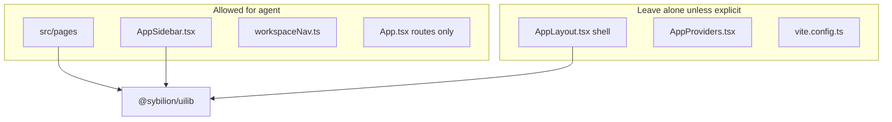

# Sybilion standalone app template

Vite + React SPA using **`@sybilion/uilib`** (layout, theme, Auth0 via `SybilionAuthProvider`) and **`@sybilion/sdk`** (Sybilion API). Use this folder as a starting point, then add product routes and data.

## Instructions for coding agents

Automation agents extend this app inside the **authenticated workspace shell**. Prefer composing **`@sybilion/uilib`**; product pages sit in **`src/pages`**, navigation in the sidebar. Do **not** redesign global chrome unless the human explicitly asks.

### Goal

Build product surfaces by assembling exported components from **`@sybilion/uilib`** (page shell, sidebar primitives, charts, widgets) while leaving the wired header/footer/host layout intact.

### Allowed edits

| Area | Files |
| ---- | ----- |
| New workspace screens | `src/pages/*` |
| Sidebar labels and links | `src/AppSidebar.tsx` (uses `Sidebar*` from `@sybilion/uilib`) |
| Stable path constants | `src/workspace/workspaceNav.ts` |
| Minimal route wiring | `src/App.tsx` — add `<Route path={…} element={…} />` + page imports **only**. Do **not** refactor auth branching, `SidebarProvider`, or callback routes. |

### Out of scope (unless explicitly requested)

| Area | Why |
| ---- | ----- |
| `src/AppLayout.tsx` | Holds **`SybilionAppHeader`**, **`PageFooter`**, **`AppHeaderHost`**, user fetch/theme/logout/menu — **shell / header / footer**. |
| `src/AppProviders.tsx`, `vite.config.ts`, Auth/sign-in UX, `.env`/branding pipelines | Bootstrap and infrastructure. |

### Using `@sybilion/uilib`

- **Default consumption**: `import { … } from '@sybilion/uilib'` (see `dist/esm/types/index.d.ts` after install).
- **Widgets vs `components/ui`**: Published **widgets** are high‑level compositions (e.g. `SignInPage`, `SybilionAuthLayout`, `SybilionAppHeader`, `SidebarDatasetsItemsGrouped`). Most building blocks (`PageHeader`, charts, **`ChartAreaInteractive`**, controls) ship from the same package root when re-exported in uilib **`src/index.ts`**. Consume them from **`@sybilion/uilib`**, not from monorepo absolute paths inside this app.
- **Source vs `#uilib`** : The uilib **source** repo uses `#uilib/…` aliases; standalone apps mirror the same APIs with **`@sybilion/uilib`** imports. Useful samples live under **`@sybilion/uilib`** source **`src/docs/pages/`** when you browse the dependency.
- **`ChartAreaInteractive`**: Implemented in **`@sybilion/uilib`**; repos like **`sybilion-client`** typically re‑export from the package only.

### Page composition

Inside the scrolled main column, keep using **`PageHeader`**, **`PageContent`**, and **`PageContentSection`**. Charts, tables, and in-page tooling belong **here** — not in `AppLayout` header/footer.

### UI glossary

Compact widget/component blurbs (**no prop lists**): **[docs/AGENT_UI_GLOSSARY.md](docs/AGENT_UI_GLOSSARY.md)**.

### Where agents may vs must not touch (overview)

## Quick start

1. Copy the folder to your app location (or work in place) and set `name` in `package.json`.
2. `yarn install` — refreshes `public/logo.svg` and `public/sybilion_bg.svg` from the installed uilib package (`postinstall`).
3. Copy `.env.example` → `.env` and fill Auth0 + API values.
4. `yarn dev` — Vite listens on `PORT` (default **3000** via [`vite-sybilion-standalone-dev.ts`](./vite-sybilion-standalone-dev.ts)).

## Global CSS and fonts

**`src/main.tsx`** imports **`./standalone-global.css`**: CSS variables (`:root` / `.dark`), base `html`/`body` rules, and `@font-face` for Manrope + KMR Apparat via **`src/fonts/`** (woff2 files alongside `fonts.css`). When you copy the template to another repo, keep this tree; tweak tokens in `standalone-global.css` if the product diverges from Sybilion defaults.

## Environment variables

| Variable | Purpose |
| -------- | ------- |
| `PORT` | Dev/preview server port; **3000** matches typical Auth0 localhost URLs. |
| `VITE_SYBILION_API_BASE_URL` | Sybilion API origin (no trailing slash). Proxy target in dev; production SDK `baseUrl`. |
| `VITE_AUTH0_DOMAIN` | Auth0 tenant domain. |
| `VITE_AUTH0_CLIENT_ID` | Auth0 SPA application client id. |

In **development**, `src/libs/sybilion-sdk.ts` uses `baseUrl: ''` so `/api/...` stays same-origin and Vite proxies `/api` to `VITE_SYBILION_API_BASE_URL`. In **production** builds, the client calls `VITE_SYBILION_API_BASE_URL` directly; the API must allow **CORS** for your deploy origin (unless you terminate API on the same host).

Configure Auth0 **Allowed Callback URLs**, **Allowed Logout URLs**, and **Allowed Web Origins** for `http://localhost:<PORT>` and your deployed origins.

## Vite config

[`vite.config.ts`](./vite.config.ts) spreads **`sybilionStandaloneViteDev({ mode })`** from [`vite-sybilion-standalone-dev.ts`](./vite-sybilion-standalone-dev.ts) and adds:

- **`resolve.dedupe`** — one copy of `react`, `react-dom`, `react-router`, `react-router-dom` (avoids invalid hook call / broken Radix context).
- **`resolve.alias`** — pin `@radix-ui/*` to the app root `node_modules` so Vite does not bundle two Radix trees.

Do not drop these unless you know the dependency tree is already deduped.

## Dependency versions

Align **`react`**, **`react-dom`**, **`react-router-dom`**, **`@auth0/auth0-react`**, and **`vite`** with the versions used by your pinned **`@sybilion/uilib`** (see its `package.json` `peerDependencies` / `devDependencies`). Use Yarn **`resolutions`** for `@types/react*` if needed. Mismatched React majors cause subtle runtime failures.

## Where to extend the app

Matches [allowed edits](#allowed-edits) for agents plus shared infrastructure humans own:

| Area | Files |
| ---- | ----- |
| Routes | `src/App.tsx` — authenticated `<Routes>` inside `AppLayout`; `/sign-in` stays outside the shell. |
| Global tokens + fonts | `src/standalone-global.css`, `src/fonts/*` — imported once from `main.tsx`. |
| Auth + theme wrappers | `src/AppProviders.tsx` |
| API client | `src/libs/sybilion-sdk.ts` — single `createSybilionSDK` instance; `getToken` reads the same key as `sybilionTokenStorageKey` on `SybilionAuthProvider`. |
| New screens | `src/pages/*` — use the route page stack below. |
| Sidebar + nav constants | `src/AppSidebar.tsx`, `src/workspace/workspaceNav.ts` |
| **[Agent UI glossary](docs/AGENT_UI_GLOSSARY.md)** | Short `@sybilion/uilib` component blurbs |

### Route page pattern

Inside the main column (already inside `AppShell` / `PageScroll`), each route should use:

1. **`PageHeader`** — `title`, optional `subheader`, optional `breadcrumbs`, optional **`actions`** (toolbar).
2. **`PageContent`** — outer body wrapper.
3. **`PageContentSection`** — one or more vertical sections.

Use an existing workspace page under `src/pages/` as a reference (for example **`DashboardPage.tsx`**).

### Theming

`ThemeProvider` (`allowLocalStorage`) wraps the app under `SybilionAuthProvider`. `AppLayout` uses **`useTheme()`** and passes `theme` / `onThemeToggle` into `SybilionAppHeader`.

### Sign-in / branding

`SignInPage` uses `SybilionAuthLayout`. Hero background defaults to **`/sybilion_bg.svg`**; logo uses **`/logo.svg`** (via uilib `Logo` / env). After `yarn install`, both files live under `public/`.

## Further reading

- [Agent UI glossary](docs/AGENT_UI_GLOSSARY.md)
- [Auth0 configuration (sybilion-client)](https://github.com/Mir-Insight/sybilion-client/blob/main/docs/auth0-configuration-guide.md)
- [Server auth verification](https://github.com/Mir-Insight/sybilion-client/blob/main/docs/server-auth-verification.md)
- Discover components: `node_modules/@sybilion/uilib/dist/esm/types/index.d.ts` or uilib `src/index.ts`.
